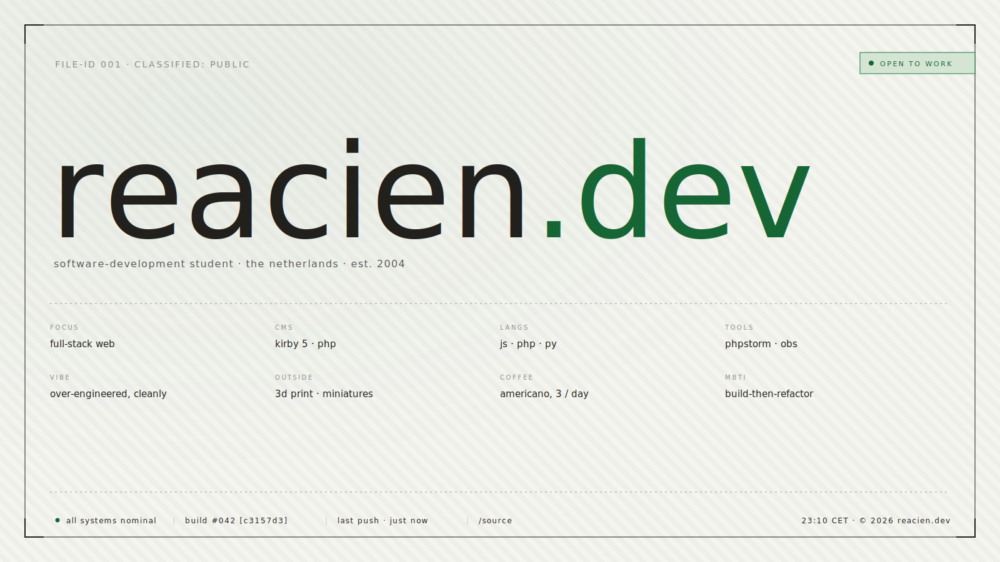

<p align="center">
  <a href="https://reacien.dev"></a>
</p>

<h1 align="center">reacien.dev</h1>

<p align="center">
  source of <a href="https://reacien.dev">reacien.dev</a> — a paper-and-terminal portfolio on kirby cms.<br>
  instrument serif + jetbrains mono. no front-end framework.
</p>

<p align="center">
  <a href="https://github.com/Reacien/reacien.dev/actions/workflows/update-build.yml"></a>
  <a href="https://reacien.dev"></a>
  <a href="https://github.com/Reacien/reacien.dev/commits/main"></a>
  <a href="LICENSE"></a>
</p>

## stack

| | | |
|---|---|---|
| `kirby` | 5.x | flat-file cms · panel |
| `php` | 8.2+ | rendering, that's about it |
| `vanilla js` | — | ~14kb total · theme toggle, cmd palette, boot overlay |
| `css` | modern | container queries, color-mix, oklch tokens |
| `instrument serif` | google fonts | every heading |
| `jetbrains mono` | google fonts | labels, kbd, build chip, terminal bits |
| `github actions` | — | writes `BUILD.json` on every push so the footer can show real build info |

no bundler, no transpilation, no dependency tree to audit. the only
`composer install` is for kirby itself.

## live build info

every push to `main` triggers `.github/workflows/update-build.yml`, which
writes a tiny `BUILD.json` at the repo root:

```json
{
  "sha":       "…",
  "short":     "…",
  "branch":    "main",
  "run":       42,
  "version":   "v0.1.42",
  "timestamp": 1736209412
}
```

the footer status bar reads that file at request time — that's where
`build #42 [c3157d3]` and `last push · 4h ago` come from. no third-party api.
if `BUILD.json` isn't present, the helper falls back to reading `.git/HEAD`,
then to static defaults in `site/config/config.php`. dev still gets a live
hash without any setup.

## file map

```text
.
├── .github/workflows/   the build-info workflow
├── assets/              css + js + images (no build step)
├── content/             kirby's flat-file content tree
├── site/
│   ├── blueprints/      panel ui · per-page + shared seo tab
│   ├── config/          base + host-aware (config.localhost.php, config.reacien.dev.php)
│   ├── plugins/         build-info reads BUILD.json / .git / config in that order
│   ├── snippets/        header, footer, status-bar, cmd-palette, site-key, boot-overlay
│   └── templates/       one per page type
└── BUILD.json           generated by the workflow on every push to main
```

## bits worth poking at

- `assets/css/tokens.css` — the whole palette and typography live here. theme
  + accent swap is just a `data-` attribute on `<html>` plus a few cascades.
- `site/snippets/cmd-palette.php` + `assets/js/cmdk.js` — `ctrl+shift+k`
  opens a keyboard palette. all entries are built server-side, the json gets
  dropped into a `<script type="application/json">` block, the front-end just
  reads and filters.
- `site/snippets/status-bar.php` — the strip at the bottom of every page.
  live clock, last-push relative time, build sha that links to the commit.
- `assets/js/boot.js` — a one-shot typewriter sequence on the home page.
  respects `prefers-reduced-motion`, fires once per session.
- `site/plugins/build-info/index.php` — falls back from `BUILD.json` → `.git`
  → `config.php` so the build chip always has *something* to show.

## design pillars

- **paper.** off-white surfaces, hairline borders, subtle stripe texture.
  the dark mode is the same idea in reverse.
- **technical.** mono labels in uppercase, file-id headers, `##`-prefixed
  section headings, terminal-style boot lines on the home page.
- **no chrome.** the only persistent ui is the breadcrumb bar at the top and
  the status bar at the bottom. everything else is content.

## license

published for reading and inspiration only — see [LICENSE](LICENSE).
not for reuse, redistribution, or re-skinning. if you want more than
inspiration, ask: hi@reacien.dev.
